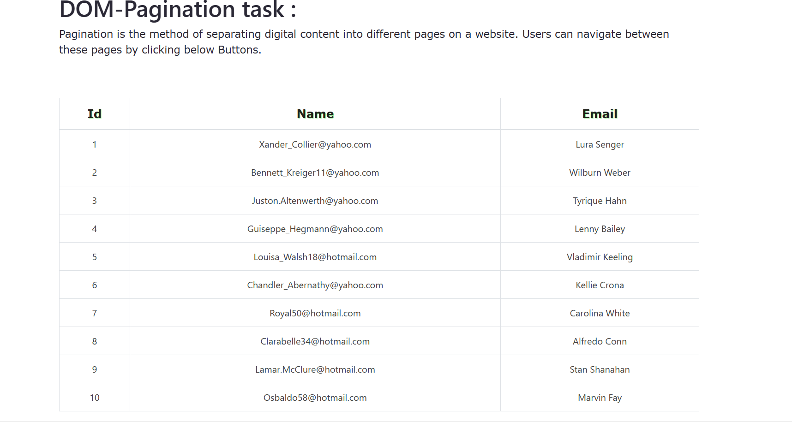
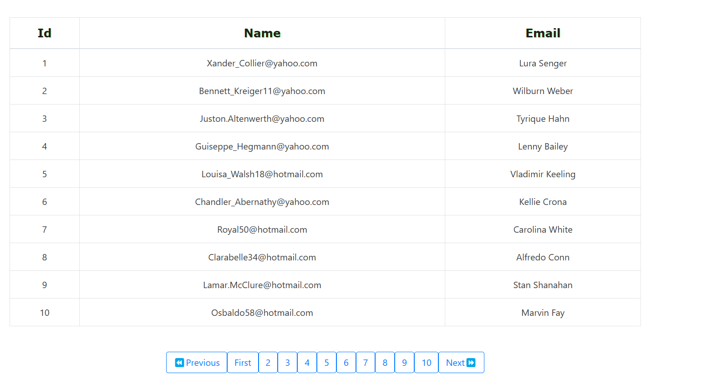

# `WEB DEVELOPER TASK`
## Pagination in DOM Manipulation

## TASK DETAILS:
1. Here I Design a Pagination in DOM manipulation.
2. Create the needed HTML elements using DOM.
3. Use only CSS for the design.
4. Didn't use any deprecated tags in DOM.
5. Added the test suite to inside the html body field.

## Here added a images for your reference

